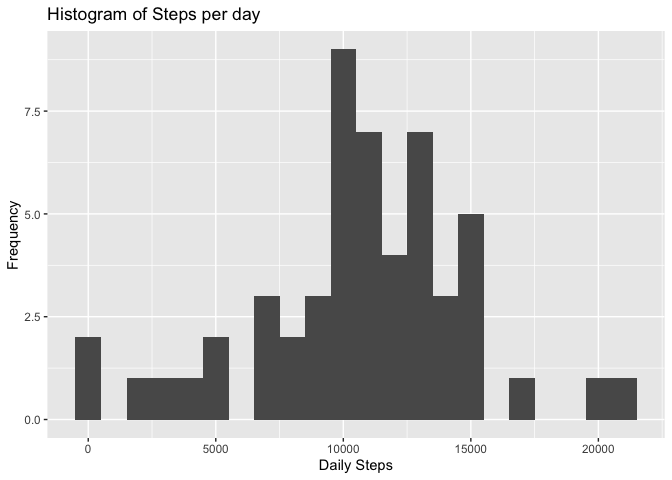
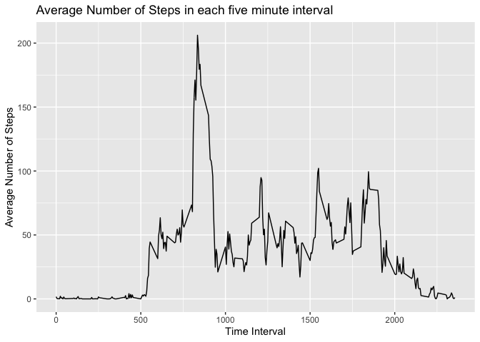
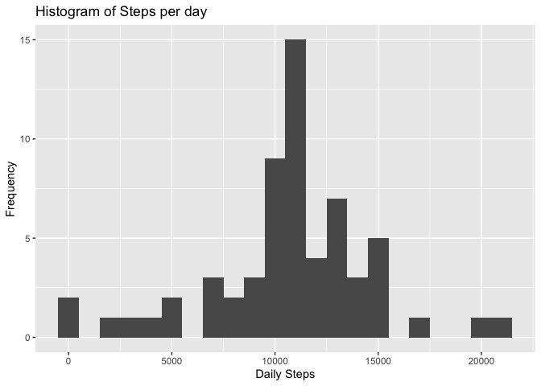
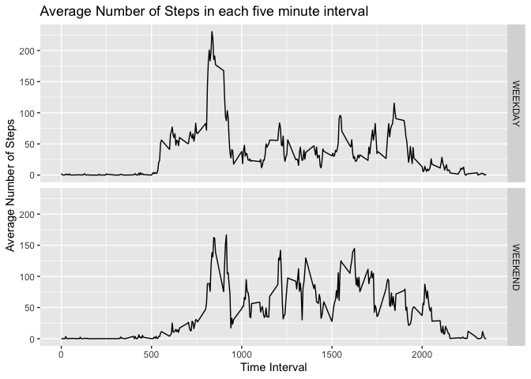

Activity Monitoring
================

Read in Data
------------

``` r
Data <- read.csv("activity.csv")
Data <- as.data.frame(Data)
Data$date <- as.Date(Data$date)
summary(Data)
```

    ##      steps             date               interval     
    ##  Min.   :  0.00   Min.   :2012-10-01   Min.   :   0.0  
    ##  1st Qu.:  0.00   1st Qu.:2012-10-16   1st Qu.: 588.8  
    ##  Median :  0.00   Median :2012-10-31   Median :1177.5  
    ##  Mean   : 37.38   Mean   :2012-10-31   Mean   :1177.5  
    ##  3rd Qu.: 12.00   3rd Qu.:2012-11-15   3rd Qu.:1766.2  
    ##  Max.   :806.00   Max.   :2012-11-30   Max.   :2355.0  
    ##  NA's   :2304

Steps Per Day
-------------

The figure below shows a histogram of the number of steps per day.

``` r
library(ggplot2)

Steps <- aggregate(steps ~ date, Data, sum)

ggplot(Steps, aes(x=steps)) + geom_histogram(binwidth=1000) +
labs(x="Daily Steps", y="Frequency") + 
labs(title="Histogram of Steps per day")
```



The median and mean number of steps per day are as follows:

``` r
median(Steps$steps)
```

    ## [1] 10765

``` r
mean(Steps$steps)
```

    ## [1] 10766.19

Average Daily Activity Pattern by Interval
------------------------------------------

``` r
Steps_interval <- aggregate(steps ~ interval, Data, mean)

ggplot(Steps_interval,aes(x = interval,y = steps)) +
geom_line() +
labs(x="Time Interval", y="Average Number of Steps") + 
labs(title="Average Number of Steps in each five minute interval")
```



The interval containing the maximum number of steps is

``` r
Steps_interval[(which.max(Steps_interval$steps)),]
```

    ##     interval    steps
    ## 104      835 206.1698

1.  

Missing Values
--------------

To find the number of missing values, we calculate the following:

``` r
sum(is.na(Data))
```

    ## [1] 2304

Imputing Missing Values
-----------------------

To impute the missing values, we use the mean value for the interval

``` r
na_list <- is.na(Data$steps)
Data_Imp <- Data

Data_Imp$steps[na_list] <- Steps_interval$steps[Steps_interval$interval %in% Data_Imp$interval]
```

``` r
library(ggplot2)

Steps_Imp <- aggregate(steps ~ date, Data_Imp, sum)

ggplot(Steps_Imp, aes(x=steps)) + geom_histogram(binwidth=1000) +
labs(x="Daily Steps", y="Frequency") + 
labs(title="Histogram of Steps per day")
```



The median and mean number of steps per day are as follows:

``` r
median(Steps_Imp$steps)
```

    ## [1] 10766.19

``` r
mean(Steps_Imp$steps)
```

    ## [1] 10766.19

Since our imputation scheme uses the mean number of steps in each interval, the mean and median number of steps per day is not significantly affected by the inclusion of imputed values.

Weekdays and Weekends
---------------------

``` r
## Function to determine if weekday or weekend
is_weekday <- function(x) {
  w <- weekdays(x)
  if(w == "Saturday" | w == "Sunday")
    {
      out <- "WEEKEND"
  }
  else
  {
    out <- "WEEKDAY"
  }
  out
}
  
Data_Imp$weekday <- sapply(Data_Imp$date,is_weekday)
```

``` r
Agg_Imp <- aggregate(steps ~ interval+weekday, Data_Imp, mean)

ggplot(Agg_Imp, aes(x=interval, y=steps)) +
  geom_line() +
  facet_grid(weekday~.) + 
labs(x="Time Interval", y="Average Number of Steps") + 
labs(title="Average Number of Steps in each five minute interval")
```


